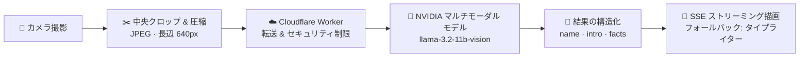

<div align="center">


# Aura‑Vision (寰宇视界)

**ミニマルで硬派な AI 視覚認知ターミナル——あなたのスマホに「何でも見抜く」力を**

[](https://github.com/Mocas-12/aura-vision/actions/workflows/deploy.yml)
[](https://react.dev)
[](https://www.typescriptlang.org)
[](https://vite.dev)
[](https://tailwindcss.com)

**[🌐 ライブプレビュー (GitHub Pages)](https://mocas-12.github.io/aura-vision/)**

[English](./README.md) | [简体中文](./README.zh-CN.md) | **日本語**

*ページを開く → カメラを許可 → どの物体でも向ける。認識は 5 秒ごとに自動実行*

</div>

---

## 📖 目次

- [特徴](#-特徴)
- [UI デザイン](#-ui-デザイン)
- [仕組み](#-仕組み)
- [プロジェクト構成](#-プロジェクト構成)
- [クイックスタート](#-クイックスタート)
- [設定](#️-設定)
- [API リファレンス](#-api-リファレンス)
- [クォータとライセンス認証](#-クォータとライセンス認証)
- [FAQ](#-faq)
- [プライバシー & セキュリティ](#-プライバシー--セキュリティ)
- [ライセンス](#-ライセンス)

## ✨ 特徴

- 🎯 **スマート認識**：NVIDIA マルチモーダル ビジョンモデル（llama‑3.2‑11b‑vision‑instruct）がフレーム中央の物体に対して中国語の「名称 + 紹介」を出力。多言語パッケージの文字にも対応
- 🔄 **2 つの認識モード**：オート モードは 5 秒ごとに認識（成功後は読みを妨げないよう 5 秒のクールダウン）。マニュアル モードはボタン押下で発火し、進行中のリクエストはいつでも中断可能
- 📡 **ストリーミング表示**：結果は SSE でトークンごとにストリーミング——発光タイトルはトークンの到着に合わせリアルタイム解析され、初トークンまでのレイテンシを ~8s から ~1s へ短縮。ストリーム非対応の旧 JSON バックエンドには自動で 1 文字ずつのタイプライター表示へフォールバック。結果パネルは最下部へ自動スクロール
- 🔊 **完了サウンド**：認識成功時に短いビープ（ミュート環境では自動で抑止）
- 📶 **ステータス & 診断**：モード切替トースト、認識中の思考アニメーション、8 秒のタイムアウト ガード、失敗診断のワンクリック コピー
- 👁️ **訪問統計**：サイト累計 PV（Worker 第一、busuanzi フォールバック）+ デバイス別訪問回数
- 🔐 **クォータ システム**：ローカルの無料枠カウント、ライセンス コードで永久解除、アカウント不要

## 🎨 UI デザイン

| 要素 | デザイン |
| --- | --- |
| ファインダー | 四隅のブラケット + 中央の破線フォーカスリング。待機時はシアン、認識中は呼吸するグロー、カメラ エラーで赤に |
| 結果パネル | 深い青のグラデーション + 微細グリッド テクスチャ + ネオン ボーダー + 四つの L 字コーナー装飾 |
| タイポグラフィ | シアン→ブルー→パープルのグラデーション発光タイトル + グラデーション区切り + 柔らかな白の本文 |
| ボタン | カプセル型アウトライン。ホバーで浮き、押下で跳ね返るマイクロインタラクション |
| 背景 | 深い青黒グラデーション + シアン/パープルのオーロラ グローで奥行きを演出 |
| モーション | スキャン ラインの走査、思考中の三点リーダ、トーストのスライドイン。システムの「動きを減らす」設定を尊重 |

## 🧠 仕組み



1. **サンプリング & 圧縮**：カメラ フレームの中央 60% をクロップし、JPEG（品質 0.5）に圧縮。長辺は 640px 以下で転送サイズを削減
2. **転送 & 転送先**：フロントエンドは Base64 画像と中国語プロンプトを Cloudflare Worker へ送り、Worker が一括転送。API キーがサーバの外に出ることはない
3. **モデル推論**：Worker が NVIDIA Integrate API（`/v1/chat/completions`）を呼び、マルチモーダル推論結果を取得
4. **クレンジング & 表示**：テキストを抽出・クレンジングし、`name / intro / facts` の構造化フィールドへ解析。SSE でトークンごとにフロントエンドへストリーミング（JSON のみの旧バックエンドはタイプライター パスで表示）

## 📁 プロジェクト構成

```text
aura-vision/
├── public/                # 静的アセット（favicon など）
├── src/
│   ├── components/
│   │   └── ActivationModal.tsx   # クォータ枯渇時のライセンス モーダル
│   ├── hooks/
│   │   └── useTypewriter.ts      # タイプライター アニメーション フック
│   ├── utils/
│   │   ├── ai-service.ts         # モデル リクエスト ラッパ & 結果解析
│   │   ├── quota.ts              # ローカル クォータ カウント & ライセンス コード検証
│   │   ├── site-stats.ts         # サイト統計フック（Worker 第一 + busuanzi フォールバック）
│   │   ├── visitor.ts            # デバイス別訪問統計
│   │   ├── config.ts             # 外部エンドポイントの統一設定
│   │   └── __tests__/            # Vitest 単体テスト
│   ├── App.tsx                   # メイン UI：ファインダー、認識ループ、結果パネル
│   ├── index.css                 # サイバーパンク テーマ スタイル
│   └── main.tsx                  # エントリ ポイント
├── e2e/
│   └── smoke.spec.ts             # Playwright スモーク：ページ ロード、ライセンス フロー
├── api/
│   ├── identify.js               # Vercel Serverless 予備フォワーダ（NVIDIA API）
│   ├── activate.js               # Vercel Serverless ライセンス コード検証
│   └── _util.js                  # 共有ヘルパ：CORS 許可リスト、レート制限、ボディ解析
├── worker/                       # 本番 Cloudflare Worker ソース（worker/README.md を参照）
└── .github/
    └── workflows/deploy.yml      # push to main → テスト → ビルド → 公開 → 本番 E2E スモーク
```

## 🚀 クイックスタート

```bash
git clone https://github.com/Mocas-12/aura-vision.git
cd aura-vision
npm install
npm run dev
```

> 初回オープン時にカメラ権限を許可してください。Chrome / Edge / Safari などモダン ブラウザを推奨。

| コマンド | 説明 |
| --- | --- |
| `npm install` | 依存をインストール |
| `npm run dev` | ローカル開発サーバを起動（カメラ権限が必要） |
| `npm run lint` | ESLint チェック |
| `npm run test` | Vitest 単体テスト |
| `npm run e2e` | Playwright スモーク テスト（本番 API 経由の実ライセンス チェーン） |
| `npm run build` | TypeScript 型チェック + 本番ビルド |

デプロイについて：`main` ブランチへの push 後、GitHub Actions が単体テスト→ビルド→GitHub Pages 公開→Playwright による本番スモークまで自動実行します。手動作業は不要です。

## ⚙️ 設定

| 項目 | 場所 | 説明 |
| --- | --- | --- |
| `NVIDIA_API_KEY` | Cloudflare Worker | 本番バックエンドのキー。Worker 側のみに保存され、フロントエンドは一切保持しない |
| `NVIDIA_API_KEY` | Vercel プロジェクト設定 | 予備 Serverless フォワーダ（`api/identify.js`）を使う場合のみ必要 |
| `NVIDIA_VISION_MODEL` | Worker 環境変数 / Vercel プロジェクト設定 | 任意。プライマリ ビジョン モデルを上書き（フォールバック チェーンは llama-3.2 90B に固定） |
| `ACTIVATION_CODES` | Vercel プロジェクト設定 | 有効なライセンス コードのリスト（カンマ/改行区切り）。設定するとコードはサーバ側で検証される |
| `ALLOWED_ORIGINS` | Worker 環境変数 / Vercel プロジェクト設定 | 任意。CORS 許可リストに追加するオリジン（カンマ区切り） |
| `VITE_WORKER_BASE` | ビルド時環境変数 | 任意。Cloudflare Worker の URL を上書き |
| `VITE_API_BASE` | ビルド時環境変数 | 任意。Vercel デプロイのベース URL。設定するとライセンス認証はサーバ側検証になる |
| `VITE_STRICT_ACTIVATION` | ビルド時環境変数 | `true` にするとバックエンド到達不能時にライセンス認証を拒否（デフォルトはオフライン フォールバックを許可） |

## 🔌 API リファレンス

- **本番チェーン（Cloudflare Worker）**
  - `POST` JSON：`{ "imageDataUrl": "<純 Base64>", "prompt": "<中国語プロンプト>", "stream": true }`
  - レスポンス：ストリーミング時は SSE トークン ストリーム。ストリーム非対応のバックエンドは NVIDIA の生構造を返し、フロントエンドは `choices[0].message.content` の抽出を優先し、解析失敗時は全文表示へフォールバック
  - ハード リミットは予備チェーンと同一：デコード後画像 ≤ 4.5MB、ボディ ≤ 8MB、IP ごとに毎分 10 リクエスト（超過で 429）
- **予備チェーン（Vercel `POST /api/identify`）**
  - リクエスト ボディ：`{ "imageDataUrl": "<純 Base64>", "prompt": "<中国語プロンプト>" }`。プロンプトはサーバ側で採用される（5〜500 文字、範囲外はデフォルト プロンプトへフォールバック）
  - デコード後の画像は約 ≤ 4.5MB に制限。IP ごとに毎分 10 リクエストのレート制限（超過で 429）
  - CORS は許可リストのオリジンのみ（GitHub Pages ドメイン + `ALLOWED_ORIGINS`）。ワイルドカードは不使用
  - モデル フォールバック チェーン：llama-3.2-11b-vision → llama-3.2-90b-vision（404 で自動切替）
- **ライセンス検証（Vercel `POST /api/activate`）**
  - リクエスト ボディ：`{ "code": "<ライセンス コード>" }`。`ACTIVATION_CODES` のリスト内なら `{ "ok": true }`、それ以外は 403
  - IP ごとに毎分 10 回のレート制限で総当たりを防止
- **ルート プローブ**：起動時、フロントエンドは Worker へ `GET` プローブを送信。404 が返ると「API ルート未設定」の警告を表示

## 🔑 クォータとライセンス認証

- フリー モード：デバイスごとに 15 回の無料認識（ローカル カウント、登録不要）。成功した認識のみカウントを消費
- クォータ枯渇時はライセンス モーダルが自動表示され、「面包多」へのリンクからライセンス コードを取得できる
- `ACTIVATION_CODES`（Vercel）と `VITE_API_BASE`（フロントエンド ビルド）を設定すると、ライセンス コードはフロントエンドの正規表現ではなくサーバ側で検証される
- バックエンドがない場合はローカルの形式チェックがフォールバックとして残る（`VITE_STRICT_ACTIVATION=true` で無効化）
- 認証後はそのデバイスが永久にアンロックされ使用制限なし

## ❓ FAQ

<details>
<summary><b>カメラが使えない / 黒画面になる</b></summary>

- ブラウザでカメラ権限が許可されているか確認（アドレス バー左のアイコンから再設定）
- 他のアプリがカメラを占有していないか確認
</details>

<details>
<summary><b>モバイルで「認識がブロックされた」と出る</b></summary>

- `Load failed` を含むエラーは、多くの場合コンテンツ ブロッカーやプライベート リレー（iCloud プライベート リレーなど）が関係しています
- それらをオフにするか、ネットワークを切り替えて再試行してください
</details>

<details>
<summary><b>長時間結果が出ない</b></summary>

- 認識リクエストには 8 秒のタイムアウト ガードがあります。タイムアウトは自動報告され、再試行できます
- オート モードでは 5 秒ごとに再試行します
</details>

<details>
<summary><b>「API ルート未設定」と表示される</b></summary>

- 起動プローブが失敗しました（Worker が 404 を返した）。Worker のルート デプロイ状況を確認してください
</details>

## 🔒 プライバシー & セキュリティ

- 📷 画像はローカルでサンプリング・圧縮されるのみ——**即時転送され、保存・永続化は一切なし**
- 🔑 API キーはサーバ側（Worker / Serverless）にのみ存在。フロントエンド コードはキーを保持しない
- 📊 訪問統計は匿名カウントのみ。個人を特定できる情報は収集しない

## 📄 ライセンス

このプロジェクトは [MIT License](LICENSE) で公開しています——著作権表示を保持すれば、商用利用を含む利用・改変・配布は自由です。

---

<div align="center">

**Made with 💙 by Unlimited Box**

🌐 [ライブプレビュー](https://mocas-12.github.io/aura-vision/) · 🐛 [Issue を報告](https://github.com/Mocas-12/aura-vision/issues) · 📧 [a18577y@gmail.com](mailto:a18577y@gmail.com)

</div>
