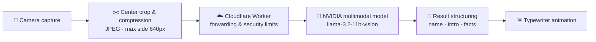

<div align="center">


# Aura‑Vision (寰宇视界)

**A minimal, hardcore AI visual perception terminal — giving your phone the ability to "see through everything"**

[](https://github.com/Mocas-12/aura-vision/actions/workflows/deploy.yml)
[](https://react.dev)
[](https://www.typescriptlang.org)
[](https://vite.dev)
[](https://tailwindcss.com)

**[🌐 Live Preview (GitHub Pages)](https://mocas-12.github.io/aura-vision/)**

**English** | [简体中文](./README.zh-CN.md)

*Open the page → allow camera access → point at any object; recognition runs automatically every 5 seconds*

</div>

---

## 📖 Table of Contents

- [Features](#-features)
- [UI Design](#-ui-design)
- [How It Works](#-how-it-works)
- [Project Structure](#-project-structure)
- [Quick Start](#-quick-start)
- [Configuration](#-configuration)
- [API Reference](#-api-reference)
- [Quota & Activation](#-quota--activation)
- [FAQ](#-faq)
- [Privacy & Security](#-privacy--security)
- [License](#-license)

## ✨ Features

- 🎯 **Smart Recognition**: Powered by the NVIDIA multimodal vision model (llama‑3.2‑11b‑vision‑instruct), outputs a Chinese "name + introduction" for the object at the center of the frame; handles multilingual packaging text
- 🔄 **Dual Recognition Modes**: Auto mode recognizes every 5 seconds (with a 5-second quiet period after success to avoid interrupting reading); manual mode triggers on button click and can interrupt the previous request at any time
- ⌨️ **Typewriter Presentation**: Results render with a gradient glowing title + character-by-character typewriter animation, and the result panel auto-scrolls to the bottom
- 🔊 **Completion Sound**: Plays a short beep on successful recognition (auto-degrades in muted scenarios)
- 📶 **Status & Diagnostics**: Mode-switch toast, thinking animation while recognizing, 8-second timeout guard, one-click copy of failure diagnostics
- 👁️ **Visit Stats**: Total site page views (Worker primary, busuanzi fallback) + per-device view count
- 🔐 **Quota System**: Local free-quota counting, permanent unlock via activation code, no account required

## 🎨 UI Design

| Element | Design |
| --- | --- |
| Viewfinder | Corner brackets + center dashed focus ring; cyan on standby, breathing glow while recognizing, turns red on camera error |
| Result panel | Deep-blue gradient + fine grid texture + neon border + four L-shaped corner decorations |
| Title typography | Cyan→blue→purple gradient glowing title + gradient divider + soft-white body text |
| Buttons | Capsule-shaped outlines with hover-lift and press-rebound micro-interactions |
| Background | Deep blue-black gradient + cyan/purple aurora glow for depth |
| Motion | Scan-line sweep, thinking ellipsis, toast slide-in; respects the system "reduce motion" setting |

## 🧠 How It Works



1. **Sampling & compression**: Crop the center 60% of the camera frame, compress to JPEG (quality 0.2), longest side no more than 640px, reducing transfer size
2. **Transfer & forwarding**: The frontend sends the Base64 image and Chinese prompt to a Cloudflare Worker, which forwards it uniformly; the API key never leaves the server
3. **Model inference**: The Worker calls the NVIDIA Integrate API (`/v1/chat/completions`) and gets the multimodal inference result
4. **Cleaning & display**: Extract and clean the text, parse it into structured `name / intro / facts` fields, rendered by the frontend with a typewriter animation

## 📁 Project Structure

```text
aura-vision/
├── public/                # Static assets (favicon, etc.)
├── src/
│   ├── components/
│   │   └── ActivationModal.tsx   # Quota-exhausted activation modal
│   ├── hooks/
│   │   └── useTypewriter.ts      # Typewriter animation hook
│   ├── utils/
│   │   ├── ai-service.ts         # Model request wrapper & result parsing
│   │   ├── quota.ts              # Local quota counting & activation code check
│   │   ├── site-stats.ts         # Site stats hook (Worker primary + busuanzi fallback)
│   │   ├── visitor.ts            # Per-device visitor stats
│   │   ├── config.ts             # Unified external endpoint config
│   │   └── __tests__/            # Vitest unit tests
│   ├── App.tsx                   # Main UI: viewfinder, recognition loop, result panel
│   ├── index.css                 # Cyberpunk theme styles
│   └── main.tsx                  # Entry point
├── e2e/
│   └── smoke.spec.ts             # Playwright smoke: page load, activation flow
├── api/
│   ├── identify.js               # Vercel Serverless backup forwarder (NVIDIA API)
│   ├── activate.js               # Vercel Serverless activation code validation
│   └── _util.js                  # Shared helpers: CORS allowlist, rate limiting, body parsing
├── worker/                       # Production Cloudflare Worker source (see worker/README.md)
└── .github/
    └── workflows/deploy.yml      # push to main → test → build → publish → production E2E smoke
```

## 🚀 Quick Start

```bash
git clone https://github.com/Mocas-12/aura-vision.git
cd aura-vision
npm install
npm run dev
```

> Allow camera permission when opening for the first time. A modern browser such as Chrome / Edge / Safari is recommended.

| Command | Description |
| --- | --- |
| `npm install` | Install dependencies |
| `npm run dev` | Start the local dev server (camera permission required) |
| `npm run lint` | ESLint check |
| `npm run test` | Vitest unit tests |
| `npm run e2e` | Playwright smoke tests (real activation chain via production API) |
| `npm run build` | TypeScript type check + production build |
| `npm run deploy` | Manually deploy to GitHub Pages (gh‑pages branch) |

Deployment note: after pushing to the `main` branch, GitHub Actions automatically runs unit tests, builds and publishes to GitHub Pages (injecting `VITE_BASE_PATH=/aura-vision/` at build time), then smoke-tests the live site with Playwright; no manual steps required.

## ⚙️ Configuration

| Item | Location | Description |
| --- | --- | --- |
| `NVIDIA_API_KEY` | Cloudflare Worker | Production backend key, stored only on the Worker side; never held by the frontend |
| `NVIDIA_API_KEY` | Vercel project settings | Only needed when using the backup Serverless forwarder (`api/identify.js`) |
| `NVIDIA_VISION_MODEL` | Vercel project settings | Optional, overrides the primary vision model (fallback chain pins llama-3.2 90B) |
| `ACTIVATION_CODES` | Vercel project settings | List of valid activation codes (comma/newline separated); when set, codes are validated server-side |
| `ALLOWED_ORIGINS` | Vercel project settings | Optional, extra CORS allow-listed origins (comma separated) |
| `VITE_WORKER_BASE` | Build-time env | Optional, overrides the Cloudflare Worker URL |
| `VITE_API_BASE` | Build-time env | Optional, Vercel deployment base URL; when set, activation goes through server-side validation |
| `VITE_STRICT_ACTIVATION` | Build-time env | Set to `true` to reject activation when the backend is unreachable (offline fallback is allowed by default) |
| `VITE_BASE_PATH` | GitHub Actions | Deployment path prefix, auto-configured in CI |

## 🔌 API Reference

- **Production chain (Cloudflare Worker)**
  - `POST` JSON: `{ "imageDataUrl": "<pure Base64>", "prompt": "<Chinese prompt>" }`
  - Response: raw NVIDIA structure; the frontend prefers extracting `choices[0].message.content`, falling back to full-text display when parsing fails
- **Backup chain (Vercel `POST /api/identify`)**
  - Request body: `{ "imageDataUrl": "<pure Base64>", "prompt": "<Chinese prompt>" }`; the prompt is now honored by the server (5–500 chars, falls back to the default prompt out of range)
  - Decoded image is limited to about ≤ 4.5MB; rate limited to 10 requests/min per IP (429 when exceeded)
  - CORS only allows allow-listed origins (the GitHub Pages domain + `ALLOWED_ORIGINS`); no more wildcard
  - Model fallback chain: llama-3.2-11b-vision → llama-3.2-90b-vision (switched automatically on 404)
- **Activation check (Vercel `POST /api/activate`)**
  - Request body: `{ "code": "<activation code>" }`; returns `{ "ok": true }` when the code is in the `ACTIVATION_CODES` list, 403 otherwise
  - Rate limited to 10 attempts/min per IP to prevent brute forcing
- **Route probe**: on startup the frontend sends a `GET` probe to the Worker; a 404 response shows an "API route not configured" warning

## 🔑 Quota & Activation

- Free mode: 15 free recognizations per device (local counting, no registration required); only successful recognitions consume quota
- An activation modal pops up automatically when the quota is exhausted, with a link to "Mianbaoduo" to get an activation code
- With `ACTIVATION_CODES` (Vercel) and `VITE_API_BASE` (frontend build) configured, activation codes are validated server-side instead of by a frontend regex
- Without a backend, a local format check remains as a fallback (disable it with `VITE_STRICT_ACTIVATION=true`)
- After activation, the device is permanently unlocked with unlimited usage

## ❓ FAQ

<details>
<summary><b>Camera unavailable / black screen</b></summary>

- Confirm the browser has camera permission allowed (reconfigure via the icon on the left of the address bar)
- Check whether another application is occupying the camera
</details>

<details>
<summary><b>Mobile reports "Recognition blocked"</b></summary>

- Errors containing `Load failed` are usually related to content blockers or private relays (e.g. iCloud Private Relay)
- Try turning those off, or switch networks and retry
</details>

<details>
<summary><b>No result for a long time</b></summary>

- Recognition requests have an 8-second timeout guard; a timeout is reported automatically and you can retry
- In auto mode, another attempt is made every 5 seconds
</details>

<details>
<summary><b>The page says "API route not configured"</b></summary>

- The startup probe failed (the Worker returned 404); check the Worker route deployment status
</details>

## 🔒 Privacy & Security

- 📷 Images are only sampled and compressed locally — **transmitted instantly, never persisted or stored**
- 🔑 API keys exist only on the server side (Worker / Serverless); the frontend code holds no keys
- 📊 Visitor stats record anonymous counts only; no personally identifiable information is collected

## 📄 License

This project is for learning and demonstration purposes only; no open-source license is set. Contact the author before reuse.

---

<div align="center">

**Made with 💙 by Unlimited Box**

🌐 [Live Preview](https://mocas-12.github.io/aura-vision/) · 🐛 [Report an Issue](https://github.com/Mocas-12/aura-vision/issues) · 📧 [a18577y@gmail.com](mailto:a18577y@gmail.com)

</div>
