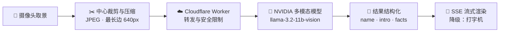

<div align="center">


# 寰宇视界 · Aura‑Vision

**极简、硬核的 AI 视觉感知终端 —— 赋予手机「看透万物」的能力**

[](https://github.com/Mocas-12/aura-vision/actions/workflows/deploy.yml)
[](https://react.dev)
[](https://www.typescriptlang.org)
[](https://vite.dev)
[](https://tailwindcss.com)

**[🌐 在线体验（GitHub Pages）](https://mocas-12.github.io/aura-vision/)**

[English](./README.md) | **简体中文** | [日本語](./README.ja-JP.md)

*打开页面 → 允许摄像头 → 对准任意物体，每 5 秒自动识别一次*

</div>

---

## 📖 目录

- [功能特性](#-功能特性)
- [界面设计](#-界面设计)
- [工作原理](#-工作原理)
- [项目结构](#-项目结构)
- [快速开始](#-快速开始)
- [配置说明](#️-配置说明)
- [接口说明](#-接口说明)
- [额度与激活](#-额度与激活)
- [常见问题](#-常见问题)
- [隐私与安全](#-隐私与安全)
- [许可证](#-许可证)

## ✨ 功能特性

- 🎯 **智能识别**：基于 NVIDIA 多模态视觉模型（llama‑3.2‑11b‑vision‑instruct），对画面中心物体输出中文「名称 + 介绍」，支持多语言包装文字
- 🔄 **双识别模式**：自动模式每 5 秒识别一次（成功后静默 5 秒，避免打断阅读）；手动模式点击按钮即识别，可随时打断上一次请求
- 📡 **流式呈现**：识别结果经 SSE 逐 token 流式输出——发光标题随 token 到达实时解析，首字延迟从 ~8s 降至 ~1s；仅支持 JSON 的旧后端自动降级为逐字打字机动画，结果区自动滚动到底部
- 🔊 **完成提示音**：识别成功播放短促提示音（可静音场景下自动降级）
- 📶 **状态与诊断**：模式切换 Toast 提示、识别中思考动画、8 秒超时保护、失败诊断信息一键复制
- 👁️ **访问统计**：站点总访问量（Worker 主通道，不蒜子回退）+ 本设备浏览次数
- 🔐 **额度系统**：本地免费额度计数，激活码永久解锁，全程无需账号

## 🎨 界面设计

| 元素 | 设计 |
| --- | --- |
| 取景框 | 四角括号 + 中心虚线对焦环；待机青色、识别中呼吸发光、摄像头异常转红 |
| 结果面板 | 深蓝渐变 + 细网格底纹 + 霓虹描边 + 四角 L 型装饰 |
| 标题排版 | 青→蓝→紫渐变发光标题 + 渐变分隔线 + 柔白正文 |
| 按钮 | 胶囊形描边，hover 上浮、按压回弹微动效 |
| 背景 | 深蓝黑渐变 + 青/紫极光光晕，营造纵深 |
| 动效 | 扫描线滑过、思考省略号、Toast 滑入；尊重系统「减弱动态效果」设置 |

## 🧠 工作原理



1. **采样与压缩**：取摄像头帧中心 60% 区域，压缩为 JPEG（质量 0.5），最长边不超过 640px，降低传输体积
2. **传输与转发**：前端将 Base64 图片与中文提示词发送至 Cloudflare Worker，由其统一转发，密钥不出服务端
3. **模型推理**：Worker 调用 NVIDIA Integrate API（`/v1/chat/completions`），获取多模态推理结果
4. **清洗与展示**：提取并清洗文本，解析为 `name / intro / facts` 结构化字段，经 SSE 逐 token 流式下发（仅 JSON 的旧后端走打字机路径）

## 📁 项目结构

```text
aura-vision/
├── public/                # 静态资源（favicon 等）
├── src/
│   ├── components/
│   │   └── ActivationModal.tsx   # 额度用尽激活弹窗
│   ├── hooks/
│   │   └── useTypewriter.ts      # 打字机动画 Hook
│   ├── utils/
│   │   ├── ai-service.ts         # 模型请求封装与结果解析
│   │   ├── quota.ts              # 本地额度计数与激活码校验
│   │   ├── site-stats.ts         # 站点统计 Hook（Worker 主通道 + 不蒜子回退）
│   │   ├── visitor.ts            # 设备级访客统计
│   │   ├── config.ts             # 外部端点统一配置
│   │   └── __tests__/            # Vitest 单元测试
│   ├── App.tsx                   # 主界面：取景、识别循环、结果面板
│   ├── index.css                 # 赛博风主题样式
│   └── main.tsx                  # 入口
├── e2e/
│   └── smoke.spec.ts             # Playwright 冒烟测试：页面加载、激活流程
├── api/
│   ├── identify.js               # Vercel Serverless 备用转发（NVIDIA API）
│   ├── activate.js               # Vercel Serverless 激活码校验
│   └── _util.js                  # 共享工具：CORS 白名单、限流、请求体解析
├── worker/                       # 生产 Cloudflare Worker 源码（见 worker/README.md）
└── .github/
    └── workflows/deploy.yml      # push 到 main → 测试 → 构建 → 发布 → 生产 E2E 冒烟
```

## 🚀 快速开始

```bash
git clone https://github.com/Mocas-12/aura-vision.git
cd aura-vision
npm install
npm run dev
```

> 首次打开请允许浏览器摄像头权限，建议使用 Chrome / Edge / Safari 等现代浏览器。

| 命令 | 说明 |
| --- | --- |
| `npm install` | 安装依赖 |
| `npm run dev` | 启动本地开发服务器（需允许摄像头） |
| `npm run lint` | ESLint 代码检查 |
| `npm run test` | Vitest 单元测试 |
| `npm run e2e` | Playwright 冒烟测试（经生产 API 验证真实激活链路） |
| `npm run build` | TypeScript 类型检查 + 生产构建 |

部署说明：`push` 到 `main` 分支后，GitHub Actions 会自动执行单元测试、构建并发布到 GitHub Pages，最后用 Playwright 对线上站点做冒烟验证，无需手动操作。

## ⚙️ 配置说明

| 配置项 | 位置 | 说明 |
| --- | --- | --- |
| `NVIDIA_API_KEY` | Cloudflare Worker | 生产后端密钥，仅保存在 Worker 端，前端不持有 |
| `NVIDIA_API_KEY` | Vercel 项目设置 | 仅在使用备用 Serverless 转发（`api/identify.js`）时需要 |
| `NVIDIA_VISION_MODEL` | Worker 环境变量 / Vercel 项目设置 | 可选，覆盖首选视觉模型（降级链固定为 llama-3.2 90B） |
| `ACTIVATION_CODES` | Vercel 项目设置 | 合法激活码清单（逗号/换行分隔）；配置后激活码改为服务端校验 |
| `ALLOWED_ORIGINS` | Worker 环境变量 / Vercel 项目设置 | 可选，额外的 CORS 白名单来源（逗号分隔） |
| `VITE_WORKER_BASE` | 构建时环境变量 | 可选，覆盖 Cloudflare Worker 地址 |
| `VITE_API_BASE` | 构建时环境变量 | 可选，Vercel 部署地址；配置后激活走服务端校验 |
| `VITE_STRICT_ACTIVATION` | 构建时环境变量 | 设为 `true` 时后端不可用即拒绝激活（默认允许离线回退） |

## 🔌 接口说明

- **生产链路（Cloudflare Worker）**
  - `POST` JSON：`{ "imageDataUrl": "<纯 Base64>", "prompt": "<中文提示词>", "stream": true }`
  - 返回：流式请求返回 SSE token 流；不支持流式的后端返回 NVIDIA 原始结构，前端优先提取 `choices[0].message.content`，解析失败时降级为全文展示
  - 硬上限与备用链路一致：图片解码后 ≤ 4.5MB、请求体 ≤ 8MB、每 IP 每分钟限 10 次（超限返回 429）
- **备用链路（Vercel `POST /api/identify`）**
  - 请求体：`{ "imageDataUrl": "<纯 Base64>", "prompt": "<中文提示词>" }`，提示词将被服务端采用（长度 5–500 字，超限回退默认提示词）
  - 图片解码后限制约 ≤ 4.5MB；每 IP 每分钟限 10 次（超限返回 429）
  - CORS 仅对白名单来源放行（GitHub Pages 域名 + `ALLOWED_ORIGINS`），不再使用通配符
  - 模型降级链：llama-3.2-11b-vision → llama-3.2-90b-vision（404 时自动切换）
- **激活校验（Vercel `POST /api/activate`）**
  - 请求体：`{ "code": "<激活码>" }`；在 `ACTIVATION_CODES` 清单内返回 `{ "ok": true }`，否则 403
  - 每 IP 每分钟限 10 次，防止穷举
- **路由探测**：前端启动后会向 Worker 发起 `GET` 探测，若返回 404 将显示「API 路由未配置」

## 🔑 额度与激活

- 免费模式：每台设备内置 15 次免费识别（本地计数，无需注册），且仅成功识别才消耗次数
- 超限后自动弹出激活弹窗，可跳转「面包多」获取激活码
- 配置 `ACTIVATION_CODES`（Vercel）与 `VITE_API_BASE`（前端构建）后，激活码由服务端校验，不再依赖前端正则
- 未配置后端时保留本地格式校验作为回退（设 `VITE_STRICT_ACTIVATION=true` 可关闭）
- 激活后本设备永久解锁，不限使用次数

## ❓ 常见问题

<details>
<summary><b>摄像头不可用 / 黑屏</b></summary>

- 确认浏览器已允许摄像头权限（地址栏左侧图标可重新设置）
- 检查是否有其他应用占用了摄像头
</details>

<details>
<summary><b>移动端识别报「识别受阻」</b></summary>

- 报错含 `Load failed` 时，多与内容拦截器、隐私转发（如 iCloud 私密转送）相关
- 尝试关闭相关开关，或更换网络后重试
</details>

<details>
<summary><b>长时间无结果</b></summary>

- 识别请求有 8 秒超时保护，超时会自动提示，可点击重试
- 自动模式下每 5 秒会再次尝试
</details>

<details>
<summary><b>页面提示「API 路由未配置」</b></summary>

- 说明启动探测未通过（Worker 返回 404），请检查 Worker 路由部署状态
</details>

## 🔒 隐私与安全

- 📷 图片仅在本地采样与压缩，**即时传输、不落库、不建立存储**
- 🔑 API 密钥仅保存在服务端（Worker / Serverless），前端代码不持有任何密钥
- 📊 访客统计只记录匿名计数，不采集个人身份信息

## 📄 许可证

本项目基于 [MIT 许可证](LICENSE) 开源——可自由使用、修改和分发（含商业用途），只需保留版权声明。

---

<div align="center">

**Made with 💙 by Unlimited Box**

🌐 [在线体验](https://mocas-12.github.io/aura-vision/) · 🐛 [问题反馈](https://github.com/Mocas-12/aura-vision/issues) · 📧 [a18577y@gmail.com](mailto:a18577y@gmail.com)

</div>
